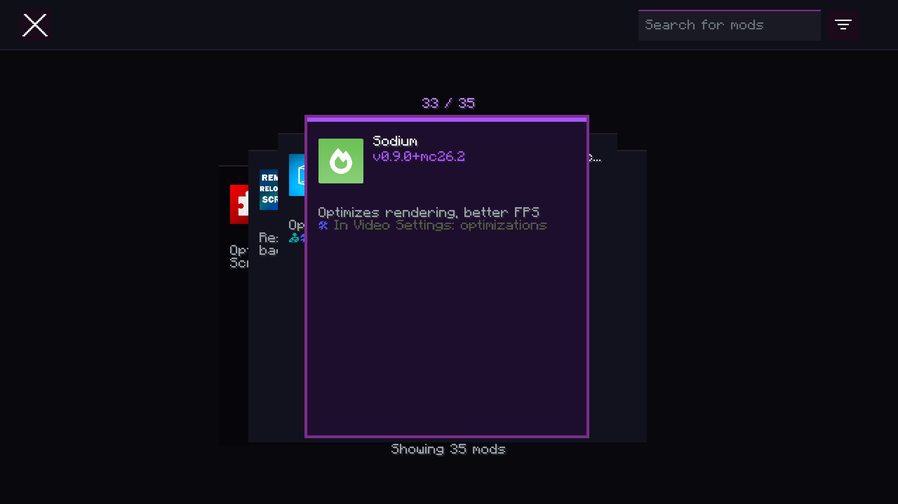

# ModStation



ModStation is a visual overhaul of the mod list screen for Fabric and Quilt. It replaces the flat list layout with a modern card-stack design, giving each mod its own dedicated panel for a cleaner, more organized look.

Beyond the refreshed interface, ModStation retains full compatibility with ModMenu's existing ecosystem — all language keys, metadata APIs, config screen integrations, and the update checker continue to work as expected.

## Features

- **Card-Stack Layout** — Each mod is displayed in its own distinct card, making it easier to browse and identify mods at a glance.
- **Search & Filter** — Quickly find mods by name, or filter by category (Client, Library, Deprecated).
- **Mod Config Screens** — If a mod provides a configuration screen, ModStation surfaces it with a single click.
- **Update Checker** — Automatically checks Modrinth for newer versions of your installed mods (configurable per mod).
- **Translation Support** — Mod names, summaries, and descriptions can be localized via language keys, same as ModMenu.
- **Library & Badge System** — Library and deprecated mods are visually distinguished and can be toggled on or off.
- **Parent/Child Grouping** — Multi-module mods (e.g., an API split into several JARs) are grouped under a single parent entry.

## Supported Platforms

ModStation is available for **Fabric** and **Quilt** on **Minecraft: Java Edition 1.14 and newer** (with separate builds for each major version range).

## Downloads

Available on [Modrinth](https://modrinth.com/mod/modstation).

## Developer Documentation

ModStation supports the same developer APIs as ModMenu. Language keys, `fabric.mod.json` / `quilt.mod.json` metadata, and the Java `ModMenuApi` interface are all fully supported.

### Language Keys

Translate your mod's name, summary, and description without touching any Java code:

```json
"modstation.nameTranslation.<modid>": "Your Mod Name",
"modstation.summaryTranslation.<modid>": "A short summary",
"modstation.descriptionTranslation.<modid>": "A longer description of your mod."
```

### Fabric / Quilt Metadata

Add badges, links, parent groupings, and disable the update checker through your mod's JSON metadata. Refer to the [ModMenu documentation](https://github.com/TerraformersMC/ModMenu) for the full metadata specification — all keys are identical under ModStation.

### Java API

Implement `ModMenuApi` (the interface name is unchanged for compatibility) to provide custom config screens or attach modpack badges. Add ModStation as a compile-time dependency:

```gradle
repositories {
    maven {
        name = "Terraformers"
        url = "https://maven.terraformersmc.com/"
    }
}

dependencies {
    modImplementation("com.terraformersmc:modmenu:<version>")
}
```

## License

MIT
